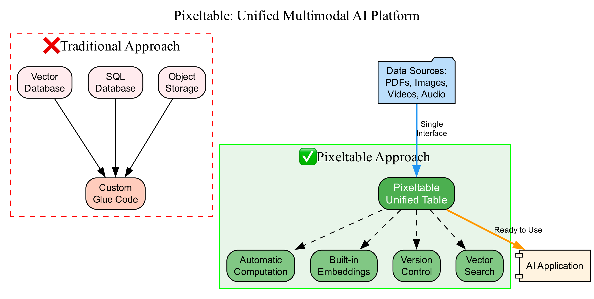

# Pixeltable Multimodal Demo

A comprehensive demonstration of **Pixeltable** - the unified framework for multimodal AI applications.



## What is Pixeltable?

**Pixeltable** revolutionizes multimodal AI development by unifying everything into a single table-based interface:

- **Documents** with automatic chunking and embedding
- **Images** with vision AI analysis
- **Videos** with frame extraction
- **Audio** with transcription
- **LLM Integration** (OpenAI, HuggingFace)
- **Vector Search** built-in
- **RAG Systems** in ~30 lines of code

### ❌ Traditional Approach
- Multiple services (Pinecone, PostgreSQL, S3)
- Complex pipeline orchestration (Airflow)
- 500+ lines of glue code
- Difficult to maintain and debug

### ✅ Pixeltable Approach
- Single unified system
- Automatic computation
- ~30 lines of code
- Built-in version control

## Installation

### Prerequisites
- Python 3.10+
- OpenAI API key (in `.env` file)

### Quick Setup

```bash
# 1. Make setup script executable
chmod +x setup.sh

# 2. Run setup (creates .venv and installs dependencies)
./setup.sh

# 3. Activate virtual environment
source .venv/bin/activate
```

### Manual Setup

```bash
# Create virtual environment
python3 -m venv .venv
source .venv/bin/activate

# Install dependencies
pip install -r requirements.txt
```

## Running the Demo

### 1. Web Application (Streamlit)

Beautiful interactive web interface with:
- Document RAG Q&A
- Image analysis with GPT-4 Vision
- Educational content about Pixeltable

```bash
streamlit run app.py
```

**Features:**
- Upload documents (PDF, TXT) and ask questions
- Upload images for AI-powered analysis
- Visual comparison of traditional vs Pixeltable approach
- Live examples of multimodal processing

### 2. Jupyter Notebook

Step-by-step tutorial with executable examples:

```bash
jupyter notebook pixeltable_demo.ipynb
```

## Key Features Demonstrated

### 1. Automatic Computation
```python
# Add computed column - automatically calculates for ALL rows
films.add_computed_column(profit=(films.revenue - films.budget))
```

### 2. Image Analysis
```python
# Add GPT-4 Vision - automatically analyzes all images
images.add_computed_column(
    vision_description=openai.vision(
        model='gpt-4o-mini',
        prompt="Describe this image",
        image=images.input_image
    )
)
```

### 3. Complete RAG System
```python
# Create documents table
docs = pxt.create_table('docs', {'doc': pxt.Document})

# Auto-chunk documents
chunks = pxt.create_view('chunks', docs, 
    iterator=DocumentSplitter.create(document=docs.doc, separators='sentence'))

# Add embedding index using .using()
embed_model = huggingface.sentence_transformer.using(model_id='all-MiniLM-L6-v2')
chunks.add_embedding_index('text', string_embed=embed_model)

# Create Q&A with automatic answer generation
qa = pxt.create_table('qa', {'prompt': pxt.String})
qa.add_computed_column(answer=openai.chat_completions(...))
```

**That's it! ~30 lines for a complete RAG system!**

## Environment Setup

Create a `.env` file with your API keys:

```bash
OPENAI_API_KEY=your_openai_api_key_here
```

## Architecture

### Traditional ML Stack
```
Application
    ↓
┌─────────────────────────────────────┐
│ Pinecone/Weaviate (Vector DB)      │
│ PostgreSQL (Metadata)               │
│ S3/MinIO (Object Storage)           │
│ Airflow (Pipeline Orchestration)    │
│ Python Scripts (Glue Code)          │
│ API Wrappers (OpenAI, HuggingFace)  │
└─────────────────────────────────────┘
```

### Pixeltable Stack
```
Application
    ↓
┌─────────────────────────────────────┐
│ Pixeltable (Everything!)            │
│  - Tables with computed columns     │
│  - Automatic updates                │
│  - Built-in versioning              │
└─────────────────────────────────────┘
```

## Resources

- **Official Docs**: https://pixeltable.readme.io/
- **GitHub**: https://github.com/pixeltable/pixeltable
- **Examples**: https://github.com/pixeltable/pixeltable/tree/main/docs/tutorials
- **Discord**: https://discord.gg/pixeltable

## License

This demo project is MIT licensed. Pixeltable itself has its own license.
